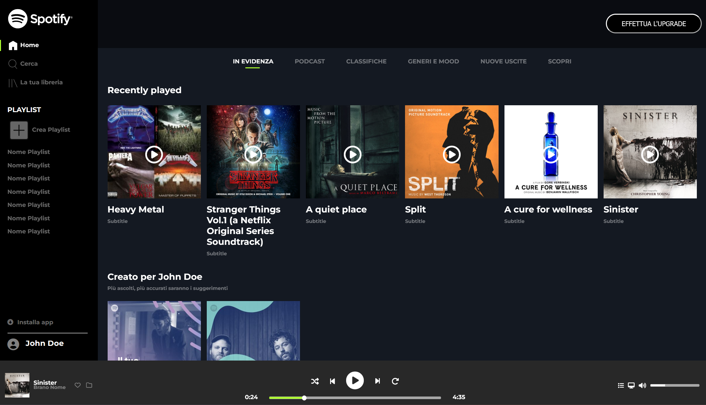
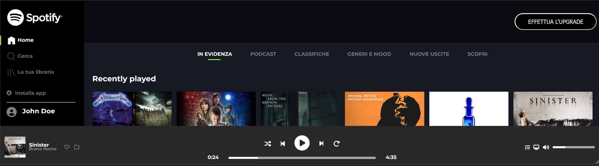
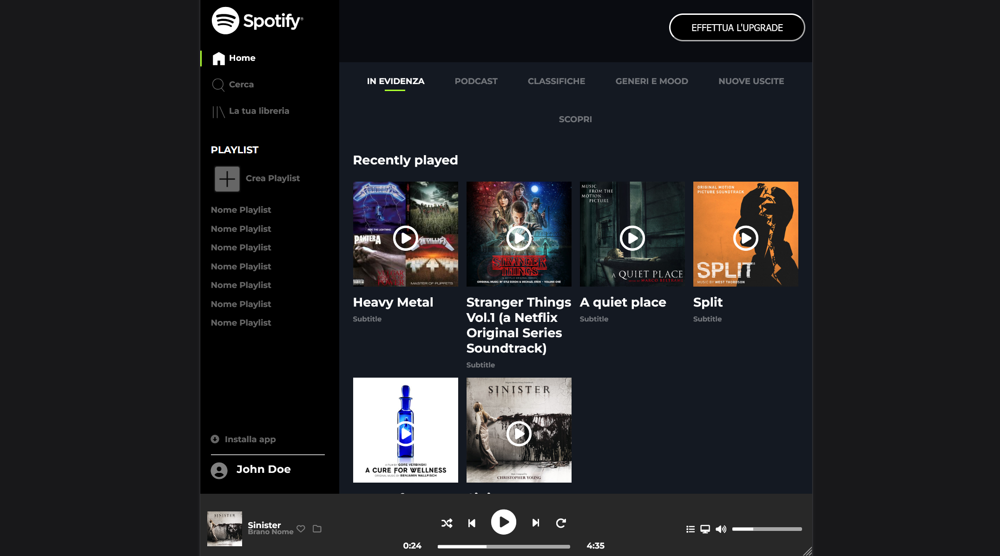
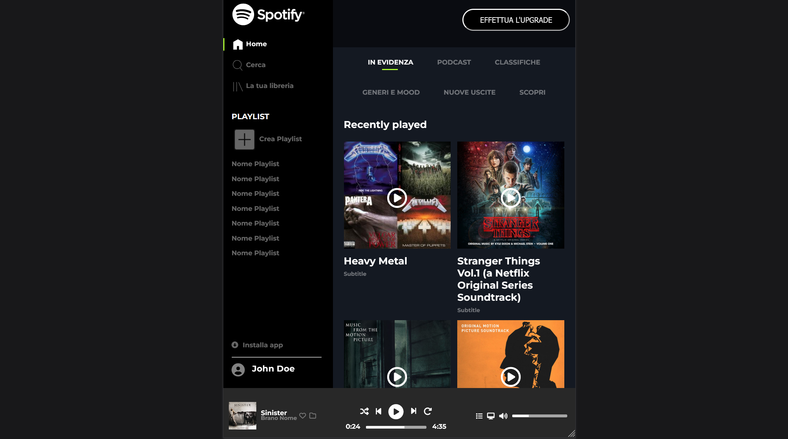
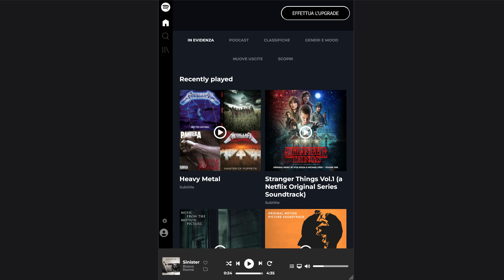

  

<h1 align="center">Spotify Web</h1>

Pagina HTML/CSS che riproduce una schermata in stile Spotify Web,
con layout a web app composto da sidebar di navigazione, area principale e player inferiore fisso.

## Obiettivo

- Riprodurre una schermata ispirata a Spotify Web
- Creare un layout tipo web app con:
  - sidebar di navigazione sempre visibile
  - area principale con le sezioni di contenuto
  - player ancorato in basso alla finestra
- Rendere il layout adattabile a più contesti:
  - desktop
  - desktop con altezza ridotta (~388px)
  - tablet
  - mobile (smartphone S)
  - mobile (smartphone XS)

## Anteprima

### Desktop

### Desktop – altezza ridotta

### Tablet

### Mobile S

### Mobile XS

## Tecnologie utilizzate

- HTML5  
- CSS3
